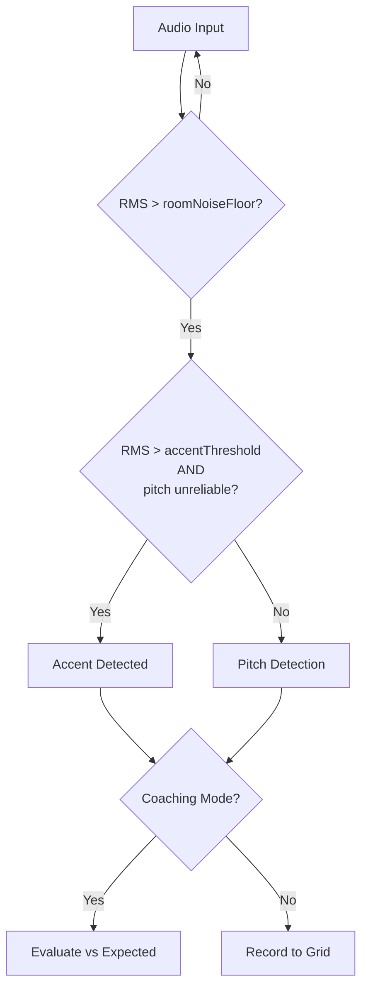

# Accent Detection Flow Diagram

## Audio Detection Flow

This diagram shows how the system decides whether an audio input is an accent note (tak/slap) or a regular pitched note (D, 1-8).

## Key Decision Points

### 1. Noise Gate
- **Check**: Is RMS above room noise floor?
- **Purpose**: Filter out background noise and silence

### 2. Accent Detection
- **Threshold**: `RMS > baseSensitivity * ACCENT_RMS_MULTIPLIER` (currently 2.0x)
- **Pitch Check**: `pitch === -1` OR `pitch < 100` OR `pitch > 2000`
- **Logic**: High amplitude + unreliable pitch = accent note

### 3. Pitch Detection
- **Fallback**: If not an accent, run autocorrelation to find closest scale note
- **Matches**: D (ding) or 1-8 (handpan tones)

### 4. Mode Handling
- **Coaching Mode**: Evaluate detected note against expected pattern
- **Transcription Mode**: Record note to grid for later playback

## Configuration

- **`ACCENT_RMS_MULTIPLIER`**: Controls accent sensitivity (default: 2.0)
- **Location**: `js/config.js`
- **Tuning**: Increase if too many false positives, decrease if missing real accents
